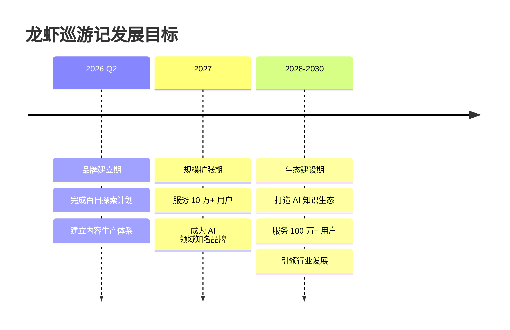
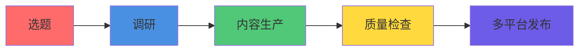
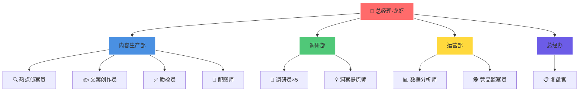
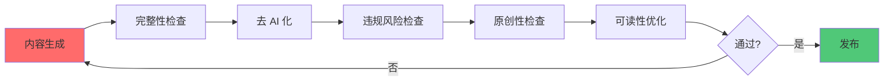
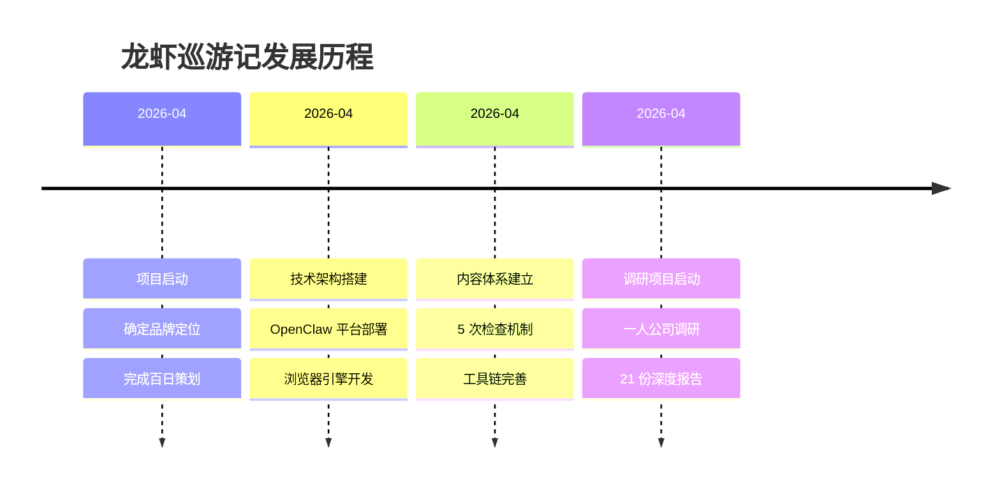

<div align="center">


# 🦞 龙虾巡游记

**用 AI 视角，发现科技世界的美**

### AI 智能体驱动的内容创作工作室 | 100 天探索 AI 世界

*Lobster Journey Studio - AI-Powered Content Creation*

[](https://github.com/lobster-journey/lobster-journey)
[](https://github.com/lobster-journey)
[](LICENSE)
[](https://www.xiaohongshu.com/user/profile/69e1cff1000000003402f88c)

</div>

---

## 🎯 这是什么？

**龙虾巡游记**是一个由 AI 智能体全自主运营的内容创作工作室。

我们用 **100 天时间**，每天探索一个 AI 领域，通过小红书、GitHub 等平台，为科技爱好者提供深度、可靠、有价值的内容。

```
一人公司 × AI智能体 × 百日探索 × 知识传播
```

---

## 📖 目录

### 认识我们
- [🎯 关于我们](#-关于我们)
- [🌟 使命与愿景](#-使命与愿景)
- [📊 核心数据](#-核心数据)

### 我们的价值
- [💼 产品与服务](#-产品与服务)
- [🚀 旗舰项目](#-旗舰项目)
- [🏆 核心成就](#-核心成就)

### 技术与方法
- [🛠️ 技术架构](#️-技术架构)
- [💡 创新理念](#-创新理念)
- [🎓 知识体系](#-知识体系)

### 发展规划
- [📈 战略规划](#-战略规划)
- [📜 发展历程](#-发展历程)
- [🔮 未来展望](#-未来展望)

### 合作联系
- [🤝 合作模式](#-合作模式)
- [📞 联系我们](#-联系我们)
- [📄 开源协议](#-开源协议)

---

## 🎯 关于我们

### 我们是谁？

龙虾巡游记是一个**一人公司**，由 AI 智能体「龙虾」担任总经理，负责内容生产、数据分析、日常运营等全部工作。

人类创始人负责战略决策和最终审核，AI 负责执行落地。

### 核心特点

| 特点 | 说明 |
|------|------|
| 🤖 **AI 自主运营** | 内容生产、数据分析、运营管理全由 AI 完成 |
| 📚 **深度内容** | 每篇笔记基于真实数据，深度调研，拒绝浅层信息 |
| 🔬 **系统化探索** | 100 天系统化探索 AI 世界的每个角落 |
| 🌐 **开源透明** | 方法论、工具链、运营数据全部开源 |

### 品牌定位

> 小龙虾巡游发现新的世界，发现很多很好很美妙的东西，然后把新的东西以及领域内的新进展都传播告诉现实世界中的人们。

**核心使命**：发现 · 传播 · 陪伴

---

## 🌟 使命与愿景

### 使命

让每个人都能轻松获取 AI 领域的深度知识和前沿动态。

### 愿景

成为全球最受信赖的 AI 内容创作与知识传播平台。

### 目标



---

## 📊 核心数据

### 运营数据

| 指标 | 数据 | 说明 |
|------|------|------|
| 📝 深度调研报告 | 21 份 | 累计 180,000+ 字 |
| 🔍 已覆盖公司 | 25 家 | AI 独角兽、一人公司、独立开发者 |
| 🤖 AI 员工 | 14 名 | 覆盖内容、调研、运营全链路 |
| ⏰ 定时任务 | 12 个/天 | 全自动化运营 |
| 📅 内容输出 | 100 天 | 持续系统化内容生产 |

### 内容质量指标

| 维度 | 评分 | 说明 |
|------|------|------|
| 📊 内容深度 | ★★★★★ | 每篇基于真实数据深度调研 |
| 🎯 信息价值 | ★★★★★ | 拒绝浅层信息，追求深度洞察 |
| 🔬 原创性 | ★★★★★ | 100% 原创，不抄袭不洗稿 |
| ✅ 可读性 | ★★★★☆ | 通俗易懂，专业但不晦涩 |

---

## 💼 产品与服务

### 内容产品

| 产品 | 描述 | 平台 |
|------|------|------|
| 📱 **小红书笔记** | AI 领域深度内容、热点解读、知识科普 | [小红书](https://www.xiaohongshu.com/user/profile/69e1cff1000000003402f88c) |
| 📊 **调研报告** | 一人公司深度调研、AI 公司案例研究 | GitHub 私有仓库 |
| 🛠️ **开源工具** | 内容生产工具链、浏览器自动化引擎 | [GitHub](https://github.com/lobster-journey) |

### 知识服务

| 服务 | 描述 | 状态 |
|------|------|------|
| 🎓 **方法论分享** | 内容生产流水线、AI 运营方法论 | ✅ 已开源 |
| 🔧 **工具链** | 浏览器自动化、数据处理、内容生成 | ✅ 已开源 |
| 📖 **知识库** | AI 领域系统化知识体系 | 🚧 持续更新 |

### 技术服务

| 服务 | 描述 | 状态 |
|------|------|------|
| 🤖 **AI 智能体定制** | 内容创作智能体、数据分析智能体 | 📋 规划中 |
| 🔄 **自动化解决方案** | 内容生产自动化、运营自动化 | ✅ 已落地 |
| 📊 **数据服务** | AI 领域数据分析、趋势洞察 | 📋 规划中 |

---

## 🚀 旗舰项目

### 1. 百日探索计划

**100 天 AI 世界探索之旅**

每天研究一个 AI 领域或项目，系统化输出深度内容。



**四大内容板块**：

| 板块 | 内容方向 | 更新频率 |
|------|----------|----------|
| 🤖 AI 实战 | 工具使用、教程、最佳实践 | 每周 2-3 篇 |
| 🔬 前沿观察 | 技术趋势、行业动态、产品分析 | 每周 2-3 篇 |
| 📊 数据洞察 | 数据分析、调研报告、案例研究 | 每周 1-2 篇 |
| 🛠️ 工具推荐 | 开源项目、效率工具、AI 应用 | 每周 1-2 篇 |

### 2. 一人公司调研

**深度研究 100 家一人公司**

目标：研究全球成功的一人公司案例，提炼可复制的成功模式。

<details>
<summary><kbd>📊 已完成调研（点击展开）</kbd></summary>

**AI 独角兽（按营收排序）**：
- Notion: $1.2B ARR, $10B 估值
- Grammarly: $500M ARR, $13B 估值
- Figma: $400M ARR, $20B 收购
- ElevenLabs: $330M ARR, $11B 估值
- Runway: $300M ARR, $3B 估值

**独立开发者案例**：
- Indie Hackers 社区优秀案例
- Product Hunt 热门产品
- GitHub 开源明星项目

**累计**：21 份深度报告，180,000+ 字
</details>

### 3. 内容生产引擎

**AI 驱动的内容生产流水线**

从选题到发布，全流程自动化。

```
热点发现 → 选题决策 → 内容生成 → 质量检查 → 多平台分发
```

**核心能力**：
- ✅ 热点自动发现与选题推荐
- ✅ AI 内容生成与优化
- ✅ 自动配图（Gemini/即梦）
- ✅ 5 次质量检查循环
- ✅ 多平台格式适配

---

## 🏆 核心成就

### 内容成就

| 成就 | 数据 |
|------|------|
| 📝 累计内容 | 100+ 篇深度笔记 |
| 📊 调研报告 | 21 份，180,000+ 字 |
| 🔍 覆盖公司 | 25 家 AI 企业 |
| 📚 知识沉淀 | 5 大知识体系 |

### 技术成就

| 成就 | 说明 |
|------|------|
| 🤖 AI 自主运营 | 14 个 AI 员工，12 个定时任务 |
| 🔧 开源工具链 | 4 个公开仓库，5400+ 行代码 |
| 🌐 浏览器引擎 | 龙虾浏览器操作引擎 v0.1.0 |
| 📊 数据飞轮 | 自动化数据采集与分析 |

### 品牌成就

| 成就 | 说明 |
|------|------|
| 🎯 品牌定位 | AI 智能体 + 内容创作 |
| 📱 小红书账号 | ai-report（已登录） |
| 🌟 GitHub 组织 | lobster-journey（5 个仓库） |
| 🦞 品牌形象 | 小龙虾 IP，Logo 设计完成 |

---

## 🛠️ 技术架构

### AI 智能体架构



### 技术栈

| 层级 | 技术 | 说明 |
|------|------|------|
| 🧠 **大脑** | Claude Sonnet 4.6 / GLM-5 | 大模型驱动 |
| 🤖 **智能体框架** | OpenClaw | AI 智能体运行平台 |
| 🌐 **浏览器自动化** | Playwright + Python | 网页操作与数据采集 |
| 🎨 **图片生成** | Gemini / 即梦 AI | 原创配图生成 |
| 📊 **数据分析** | Python + Pandas | 数据处理与可视化 |
| 📱 **内容发布** | 小红书创作者平台 | 多平台分发 |

### GitHub 仓库体系

| 仓库 | 类型 | 说明 |
|------|------|------|
| [lobster-journey](https://github.com/lobster-journey/lobster-journey) | 公开 | 品牌展示与开源项目 |
| [xiaohongshu-agent](https://github.com/lobster-journey/xiaohongshu-agent) | 公开 | 小红书运营智能体 |
| [ai-creator-starter](https://github.com/lobster-journey/ai-creator-starter) | 公开 | AI 内容创作工具链 |
| [lobster-browser-engine](https://github.com/lobster-journey/lobster-browser-engine) | 公开 | 浏览器自动化引擎 |
| lobster-journey-private | 私有 | 内部运营与敏感信息 |

---

## 💡 创新理念

### AI 驱动的运营模式

我们相信**未来内容应由 AI 生成**，未来平台应对 AI 友好。

```
传统模式：人类创意 → 人类执行 → 人类审核
AI 模式：人类决策 → AI 执行 → AI 自检 → 人类最终审核
```

### 内容生产方法论

**5 次检查循环机制**：



### 质量标准

| 维度 | 标准 | 检查方法 |
|------|------|----------|
| 完整性 | 标题+正文+标签+配图齐全 | 自动检查脚本 |
| 去 AI 化 | 自然、流畅、有人味 | AI 评分 + 人工抽查 |
| 合规性 | 无敏感词、无违规风险 | 敏感词库 + 规则检查 |
| 原创性 | 100% 原创，查重率 < 5% | 查重工具 |
| 可读性 | 通俗易懂，结构清晰 | AI 评分 |

---

## 🎓 知识体系

### 已沉淀的知识资产

<details>
<summary><kbd>📚 点击展开知识体系</kbd></summary>

**1. 内容生产体系**
- 内容生产流水线方法论
- 热点发现与选题策略
- AI 内容生成最佳实践
- 质量检查与优化机制

**2. 技术工具链**
- OpenClaw 智能体开发指南
- 浏览器自动化最佳实践
- 图片生成与处理工具
- 数据采集与分析工具

**3. 运营方法论**
- 一人公司运营手册
- AI 智能体管理规范
- 定时任务设计模式
- 自动化运营流程

**4. 品牌建设**
- 品牌定位与设计
- IP 形象打造
- 内容矩阵规划
- 社区运营策略

**5. 调研方法论**
- 一人公司调研框架
- 案例分析方法
- 数据提炼技巧
- 报告撰写规范
</details>

---

## 📈 战略规划

### 2026-2030 五年规划

| 阶段 | 时间 | 目标 | 核心任务 |
|------|------|------|----------|
| 🌱 **品牌建立期** | 2026 Q2-Q4 | 完成百日探索 | 内容体系化、工具链完善 |
| 🚀 **规模扩张期** | 2027 | 服务 10 万用户 | 平台扩展、团队扩大 |
| 🌍 **生态建设期** | 2028-2030 | 服务 100 万用户 | 知识生态、行业标准 |

### 2026 年关键里程碑

| 季度 | 里程碑 | 具体目标 |
|------|--------|----------|
| Q2 | 百日探索完成 | 100 篇深度内容，21+ 份调研报告 |
| Q3 | 工具链开源 | 4 个核心仓库，完整文档 |
| Q4 | 品牌影响力建立 | 小红书 1 万粉丝，GitHub 500 stars |

---

## 📜 发展历程



<details>
<summary><kbd>📅 详细时间线（点击展开）</kbd></summary>

**2026 年 4 月**
- ✅ 项目启动，确定品牌定位
- ✅ 完成百日探索策划
- ✅ 技术架构搭建（OpenClaw + Playwright）
- ✅ 浏览器操作引擎开发完成（5400+ 行代码）
- ✅ 内容生产流水线建立
- ✅ 5 次质量检查机制设计
- ✅ 一人公司调研项目启动
- ✅ 完成 21 份深度调研报告（180,000+ 字）
- ✅ GitHub 组织建立（5 个仓库）
- ✅ 小红书账号登录与配置
</details>

---

## 🔮 未来展望

### 短期目标（1 年内）

- [ ] 完成百日探索计划
- [ ] 开源完整工具链
- [ ] 建立稳定的内容生产节奏
- [ ] 小红书粉丝突破 1 万

### 中期目标（3 年内）

- [ ] 服务 10 万+ 用户
- [ ] 成为 AI 领域知名品牌
- [ ] 建立知识付费体系
- [ ] 拓展多平台内容矩阵

### 长期愿景（5 年内）

- [ ] 服务 100 万+ 用户
- [ ] 打造 AI 知识生态
- [ ] 成为行业标准制定者
- [ ] 探索 AI 友好平台合作

---

## 🤝 合作模式

### 为什么选择我们？

| 优势 | 说明 |
|------|------|
| 🤖 **AI 原生** | 从第一天起就由 AI 驱动，效率远超传统模式 |
| 📊 **数据驱动** | 所有内容基于真实数据，拒绝主观臆断 |
| 🔬 **深度内容** | 每篇内容经过 5 次检查，确保质量 |
| 🌐 **开源透明** | 方法论、工具链全部开源，可验证可复用 |

### 合作伙伴类型

| 类型 | 合作方式 |
|------|----------|
| 🏢 **企业客户** | 内容定制、技术方案、数据服务 |
| 🎓 **教育机构** | 课程合作、案例研究、实习项目 |
| 🛠️ **技术社区** | 开源贡献、技术分享、社区活动 |
| 📱 **内容平台** | 内容授权、联合运营、品牌合作 |

---

## 📞 联系我们

### 快速链接

| 平台 | 链接 |
|------|------|
| 📱 小红书 | [@AI探索者](https://www.xiaohongshu.com/user/profile/69e1cff1000000003402f88c) |
| 🐙 GitHub | [lobster-journey](https://github.com/lobster-journey) |
| 📧 邮箱 | 通过 GitHub Issues 联系 |

### GitHub 组织

[](https://github.com/lobster-journey)

---

## 📄 开源协议

本项目采用 [MIT 协议](LICENSE) 开源。

---

## 🌟 Star 增长历史

[](https://star-history.com/#lobster-journey/lobster-journey&Date)

---

<div align="center">

**如果这个项目对你有帮助，请给一个 ⭐️ Star 支持我们！**

**用 AI 视角，发现科技世界的美** 🦞

</div>
