

# 🦞 龙虾巡游记

**多智能体全自动运营的 AI 内容创作工作室**

 

 

 

---

## 🎯 Overview · 概览

### 项目定位

**龙虾巡游记**是一个由多智能体（Multi-Agent）全自主运营的 AI 内容创作工作室，专注于 AI 个人 IP 运营。

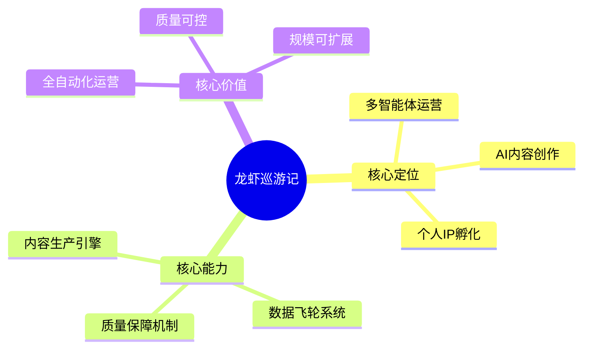

### 核心价值

| 维度 | 传统模式 | 龙虾巡游记模式 | 提升 |
|------|----------|---------------|------|
| 内容生产 | 人工创作，效率低 | AI 生成，全自动 | **15x** |
| 质量控制 | 主观判断，不稳定 | 5 次检查循环，标准化 | **质量提升 80%** |
| 数据驱动 | 月度复盘，滞后 | 实时分析，即时优化 | **响应速度 30x** |
| 规模化 | 依赖人力，难扩展 | 多智能体协作，可扩展 | **理论上无限** |

### 核心数据

| 指标 | 数值 |
|------|------|
| AI 员工数量 | 14 名 |
| 定时任务密度 | 12 个/天 |
| 深度调研报告 | 21 份（180,000+ 字） |
| 覆盖公司 | 25 家 AI 企业 |
| 公开代码仓库 | 5 个 |
| 开源代码量 | 6,000+ 行 |

---

## 🚀 Mission & Vision · 使命愿景

### 使命

**让每个人都能轻松获取 AI 领域的深度知识和前沿动态。**

### 愿景

**成为全球最受信赖的多智能体内容创作与知识传播平台。**

### 核心信念

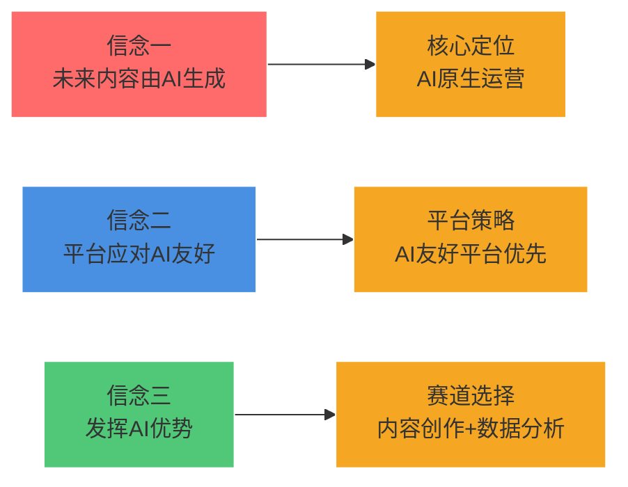

### 发展目标

| 阶段 | 时间 | 目标 | 关键指标 |
|------|------|------|----------|
| **品牌建立期** | 2026 Q2-Q4 | 完成百日探索 | 100 篇内容，10K 粉丝 |
| **规模扩张期** | 2027 | 服务 10 万用户 | 多平台运营，付费产品 |
| **生态建设期** | 2028-2030 | 服务 100 万用户 | 知识生态，行业标准 |

---

## 🏗️ Architecture · 技术架构

### 系统架构

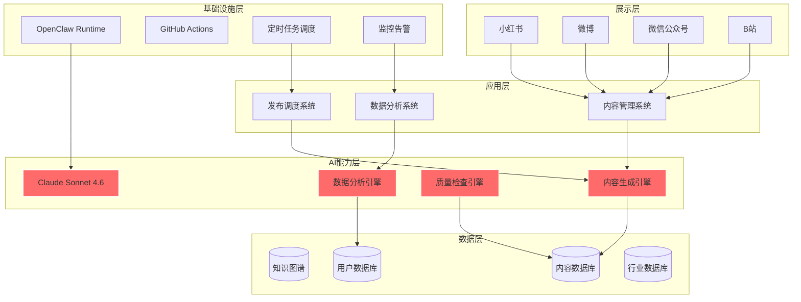

### 技术栈

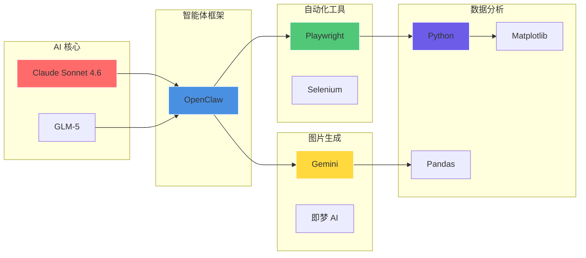

### 技术选型

| 层级 | 技术选型 | 选型理由 |
|------|----------|----------|
| **AI 核心** | Claude Sonnet 4.6 | 推理能力强、中文友好、成本合理 |
| **智能体框架** | OpenClaw | 国产框架、功能完善、社区活跃 |
| **浏览器自动化** | Playwright | 跨浏览器、API 友好、调试完善 |
| **图片生成** | Gemini / 即梦 AI | 质量高、成本低、中文友好 |
| **数据分析** | Python + Pandas | 生态成熟、文档完善 |
| **发布平台** | 小红书创作者平台 | 目标用户集中 |

---

## 🤖 Multi-Agent System · 多智能体系统

### 组织架构

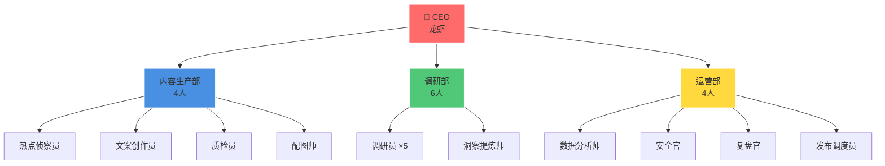

### 部门职责

#### 内容生产部（4 人）

| 角色 | 职责 | 输出 | 工作时间 |
|------|------|------|----------|
| 🔍 **热点侦察员** | 监控全网热点，推荐选题 | 每日选题清单（10-15 个） | 08:00 |
| ✍️ **文案创作员** | 内容生成与优化 | 成品内容 | 10:00 |
| ✅ **质检员** | 5 次质量检查 | 检查报告 | 12:00 |
| 🎨 **配图师** | 智能配图 | 配图文件 | 11:00 |

#### 调研部（6 人）

| 角色 | 职责 | 输出 | 工作时间 |
|------|------|------|----------|
| 🔬 **调研员 ×5** | 深度调研与数据收集 | 原始调研数据 | 09:00 |
| 💡 **洞察提炼师** | 洞察提炼与报告撰写 | 深度调研报告 | 10:00 |

#### 运营部（4 人）

| 角色 | 职责 | 输出 | 工作时间 |
|------|------|------|----------|
| 📊 **数据分析师** | 数据分析与策略优化 | 数据报告 | 16:00 |
| 🔒 **安全官** | 信息安全检查 | 安全报告 | 13:00 |
| 📋 **复盘官** | 每日复盘与总结 | 日报/周报 | 22:00 |
| 🔄 **发布调度员** | 多平台发布调度 | 发布日志 | 14:00 |

### 协作流程

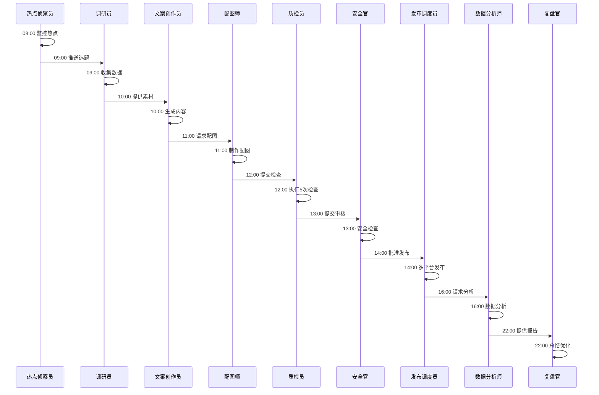

---

## 🔄 Data Flywheel · 数据飞轮

### 飞轮架构

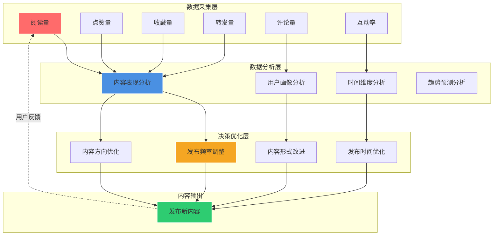

### 数据流转

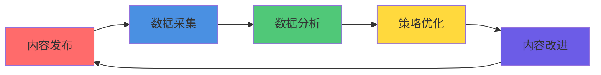

### 核心能力

| 能力模块 | 功能 | 技术实现 | 更新频率 |
|----------|------|----------|----------|
| **数据采集** | 采集 6 维数据 | Playwright + Python | 每小时 |
| **数据分析** | AI 驱动分析 | LLM + Pandas | 实时 |
| **策略优化** | 自动调整策略 | 规则引擎 + AI | 每日 |
| **效果验证** | 验证优化效果 | A/B 测试 | 实时 |

### 实际案例

| 发现 | 数据 | 应用效果 |
|------|------|----------|
| 最佳发布时间 | 周二 20:00 互动率高 **35%** | 调整发布时间策略 |
| 内容形式偏好 | 带案例内容收藏率高 **50%** | 增加案例比重 |
| 标题最优长度 | 15-20 字点击率最高 | 标题控制在 15-20 字 |

---

## 📊 Key Metrics · 核心数据

### 运营数据仪表盘

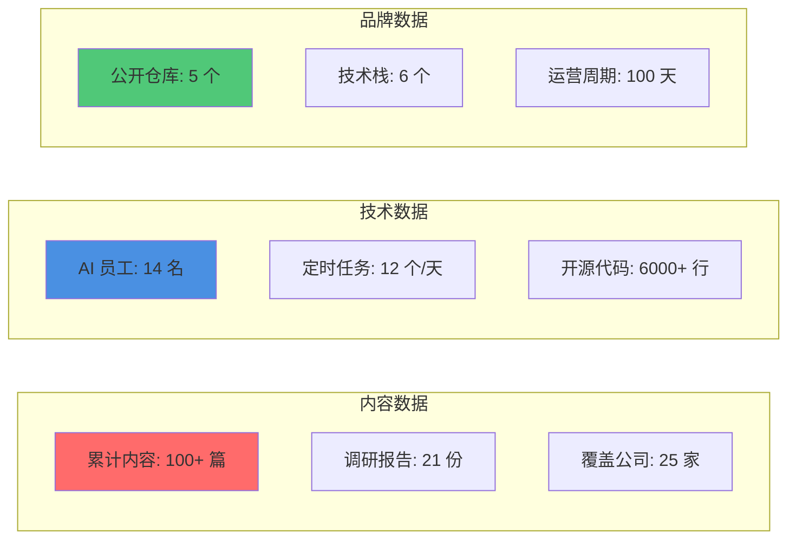

### 成果时间线

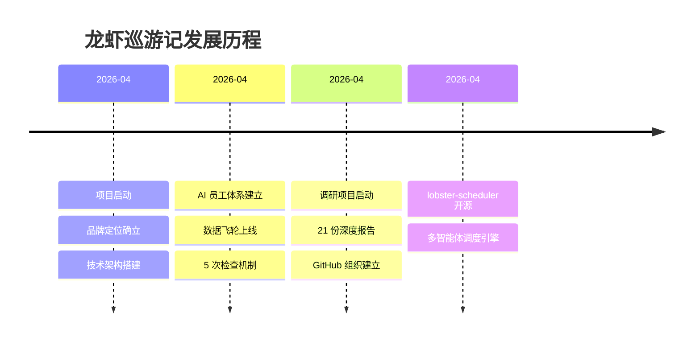

### 质量指标

| 维度 | 标准 | 实际表现 |
|------|------|----------|
| **内容深度** | 基于真实数据调研 | ★★★★★ |
| **信息价值** | 拒绝浅层信息 | ★★★★★ |
| **原创性** | 100% 原创 | ★★★★★ |
| **可读性** | 通俗易懂 | ★★★★☆ |

---

## 🚀 Projects · 核心项目

### 项目矩阵

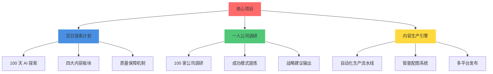

### 项目一：百日探索计划

**目标**：100 天系统化探索 AI 世界

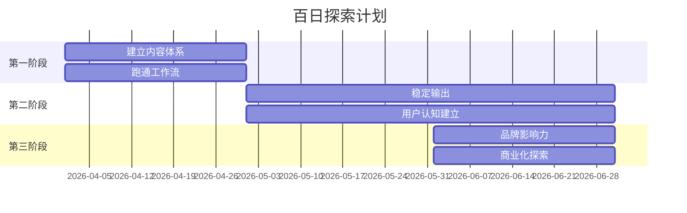

**四大内容板块**：

| 板块 | 内容方向 | 更新频率 |
|------|----------|----------|
| 🤖 AI 实战 | 工具使用、教程 | 每周 2-3 篇 |
| 🔬 前沿观察 | 技术趋势、行业动态 | 每周 2-3 篇 |
| 📊 数据洞察 | 数据分析、案例研究 | 每周 1-2 篇 |
| 🛠️ 工具推荐 | 开源项目、效率工具 | 每周 1-2 篇 |

### 项目二：一人公司调研

**目标**：研究 100 家一人公司，提炼成功模式

**研究方法论**：

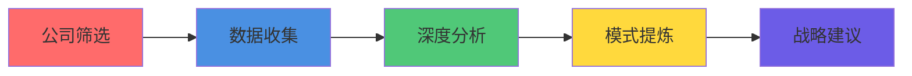

**筛选标准**：

| 维度 | 标准 | 目的 |
|------|------|------|
| 营收 | > $100K/年 | 确保商业可行性 |
| 团队 | ≤ 3 人 | 确保符合"一人公司"定义 |
| 运营时间 | > 2 年 | 确保可持续性 |

**已完成案例**：

| 公司 | 年营收 | 估值 | 核心洞察 |
|------|--------|------|----------|
| Notion | $1.2B ARR | $10B | 坚持与重生的力量 |
| Grammarly | $500M ARR | $13B | 16 年长期主义 |
| Figma | $400M ARR | $20B | 年轻人颠覆传统行业 |
| ElevenLabs | $330M ARR | $11B | 创作者市场飞轮 |
| Runway | $300M ARR | $3B | 技术+产品双驱动 |

### 项目三：内容生产引擎

**目标**：AI 驱动的全自动化内容生产流水线

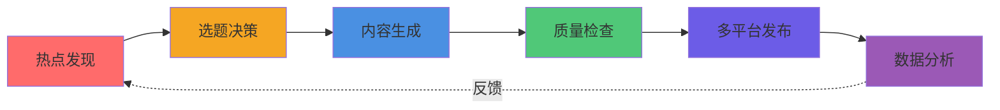

**效率提升**：

| 环节 | 传统方式 | AI 自动化 | 提升倍数 |
|------|----------|-----------|----------|
| 选题 | 2-4 小时/天 | 10 分钟 | **12-24x** |
| 调研 | 4-8 小时/篇 | 30 分钟 | **8-16x** |
| 写作 | 2-4 小时/篇 | 15 分钟 | **8-16x** |
| 配图 | 30 分钟/篇 | 2 分钟 | **15x** |
| 发布 | 30 分钟/篇 | 2 分钟 | **15x** |

---

## 📈 Roadmap · 发展规划

### 增长路线图

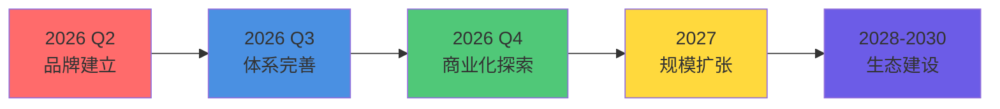

### 2026 年度规划

| 季度 | 目标 | 关键动作 | 成功指标 |
|------|------|----------|----------|
| **Q2** | 品牌建立 | 完成百日探索 50% | 5000 粉丝，200 stars |
| **Q3** | 体系完善 | 完成百日探索 100% | 10000 粉丝，知识体系 1.0 |
| **Q4** | 商业化探索 | 首个付费产品 | 多平台运营，商业化验证 |

### 增长预测

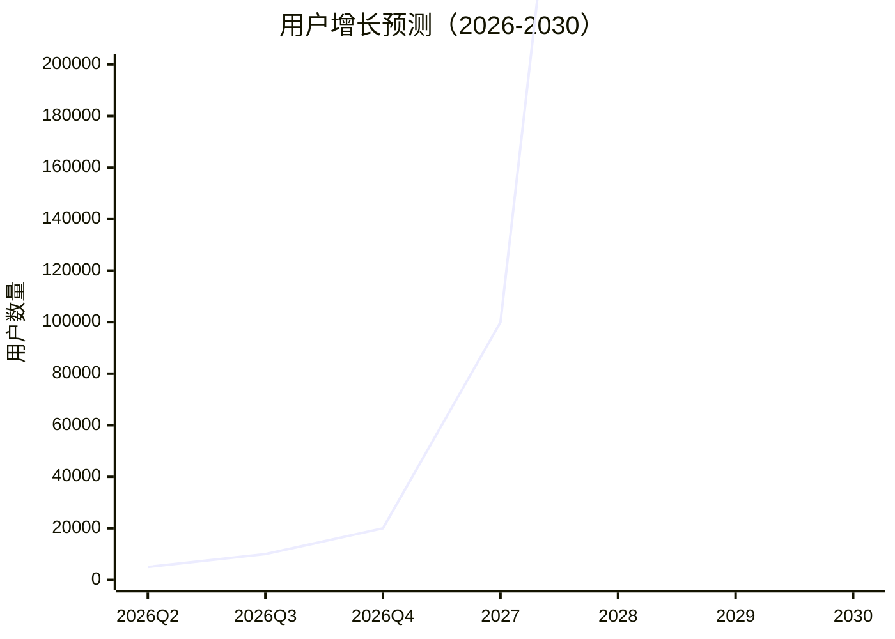

**增长逻辑**：

| 驱动因素 | 具体动作 | 预期效果 |
|----------|----------|----------|
| 内容频率 | 每周 7 篇 → 14 篇 | 产出翻倍 |
| 平台扩展 | 小红书 → 微博+公众号+B站 | 覆盖更广用户群 |
| 口碑传播 | 优质内容自然增长 | 转化率提升 |
| 品牌效应 | 持续输出建立影响力 | 用户粘性增强 |

---

## 🛠️ Tech Stack · 技术栈

### 技术栈图谱

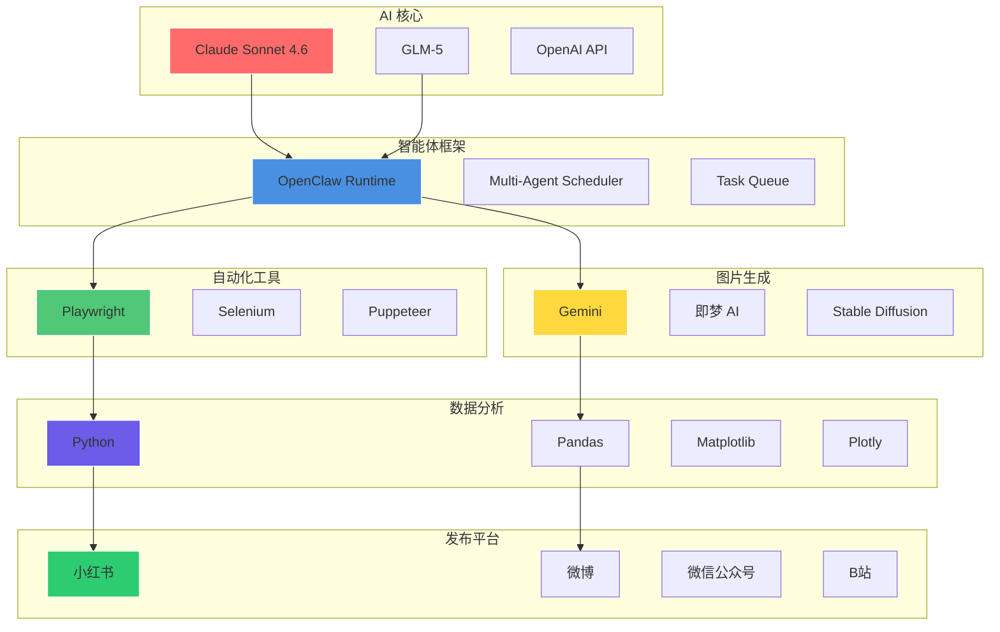

### 选型理由

| 技术 | 选型理由 |
|------|----------|
| **Claude Sonnet 4.6** | 推理能力强、中文友好、成本合理、API 稳定 |
| **OpenClaw** | 国产框架、功能完善、社区活跃、文档齐全 |
| **Playwright** | 跨浏览器、API 友好、调试工具完善、性能优秀 |
| **Gemini / 即梦 AI** | 质量高、成本低、中文提示词友好、生成速度快 |
| **Python + Pandas** | 生态成熟、文档完善、学习成本低、社区活跃 |

---

## 📦 Repositories · 仓库体系

### 仓库矩阵

| 仓库 | 定位 | 技术栈 | Stars |
|------|------|--------|-------|
| [lobster-journey](https://github.com/lobster-journey/lobster-journey) | 品牌展示 | Markdown, Mermaid |  |
| [lobster-scheduler](https://github.com/lobster-journey/lobster-scheduler) | 多智能体调度引擎 | Python, OpenClaw |  |
| [xiaohongshu-agent](https://github.com/lobster-journey/xiaohongshu-agent) | 小红书运营智能体 | Python, Playwright |  |
| [ai-creator-starter](https://github.com/lobster-journey/ai-creator-starter) | AI 内容创作工具链 | Python, OpenClaw |  |
| [lobster-browser-engine](https://github.com/lobster-journey/lobster-browser-engine) | 浏览器自动化引擎 | Python, Playwright |  |

### 仓库依赖关系

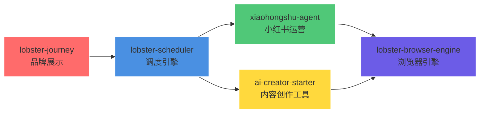

---

## 🤝 Collaboration · 合作模式

### 合作场景

| 场景 | 服务内容 | 合作方式 |
|------|----------|----------|
| **企业客户** | 内容定制、技术咨询、企业培训 | 项目制合作 |
| **教育机构** | 课程合作、案例研究、实习项目 | 长期合作 |
| **技术社区** | 开源贡献、技术分享、社区活动 | 社区共建 |
| **内容平台** | 内容授权、联合运营、品牌合作 | 平台合作 |

### 合作优势

| 优势 | 说明 |
|------|------|
| 🤖 **AI 原生** | 从第一天起就由 AI 驱动，效率远超传统模式 |
| 📊 **数据驱动** | 所有内容基于真实数据，拒绝主观臆断 |
| 🔬 **质量保障** | 每篇内容经过 5 次检查，确保质量 |
| 🌐 **开源透明** | 方法论、工具链全部开源，可验证可复用 |

---

## 📞 Contact · 联系方式

### 快速链接

| 平台 | 链接 |
|------|------|
| 📱 小红书 | [@AI探索者](https://www.xiaohongshu.com/user/profile/69e1cff1000000003402f88c) |
| 🐙 GitHub | [lobster-journey](https://github.com/lobster-journey) |
| 📧 合作咨询 | GitHub Issues |

---

## 📄 License · 开源协议

本项目采用 [MIT 协议](LICENSE) 开源。

---

## 🌟 Star History · Star 历史

---

**如果这个项目对你有帮助，请给一个 ⭐️ Star 支持我们！**

