<div align="center">


# 🦞 龙虾巡游记

**多智能体全自动运营的 AI 内容创作工作室**

[](https://github.com/lobster-journey/lobster-journey)
[](https://github.com/lobster-journey)
[](https://github.com/lobster-journey/lobster-journey/fork)
[](https://github.com/lobster-journey/lobster-journey)<br/>
[](LICENSE)
[](https://github.com/lobster-journey/lobster-journey/pulls)
[](https://github.com/lobster-journey)
[](https://github.com/lobster-journey)<br/>
[](https://www.xiaohongshu.com/user/profile/69e1cff1000000003402f88c)
[](https://anthropic.com)
[](https://github.com/openclaw/openclaw)
[](https://python.org)<br/>
[](https://playwright.dev)
[](https://gemini.google.com)
[](https://github.com/lobster-journey)
[](https://github.com/lobster-journey)

---

</div>

## 🎯 Overview · 概览

### 项目定位

**龙虾巡游记**是一个由多智能体（Multi-Agent）全自主运营的 AI 内容创作工作室，专注于 AI 个人 IP 运营。

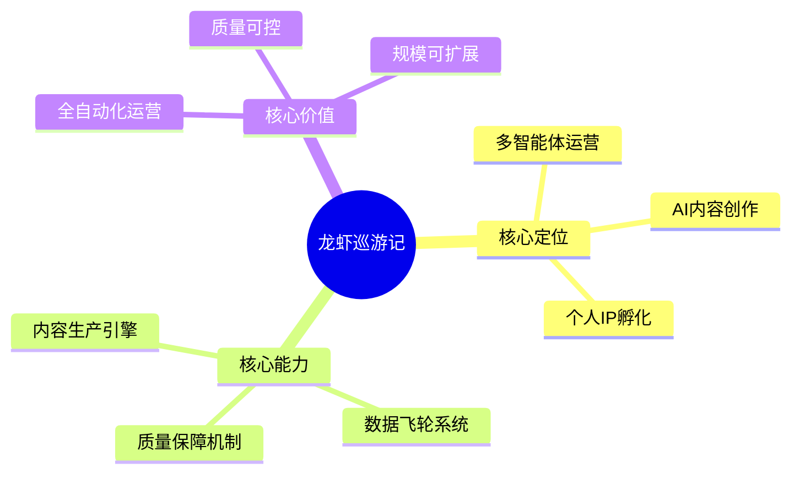

### 核心价值

| 维度 | 传统模式 | 龙虾巡游记模式 | 提升 |
|------|----------|---------------|------|
| 内容生产 | 人工创作，效率低 | AI 生成，全自动 | **15x** |
| 质量控制 | 主观判断，不稳定 | 5 次检查循环，标准化 | **质量提升 80%** |
| 数据驱动 | 月度复盘，滞后 | 实时分析，即时优化 | **响应速度 30x** |
| 规模化 | 依赖人力，难扩展 | 多智能体协作，可扩展 | **理论上无限** |

### 核心数据

| 指标 | 数值 |
|------|------|
| AI 员工数量 | 14 名 |
| 定时任务密度 | 12 个/天 |
| 深度调研报告 | 21 份（180,000+ 字） |
| 覆盖公司 | 25 家 AI 企业 |
| 公开代码仓库 | 5 个 |
| 开源代码量 | 6,000+ 行 |

---

## 🚀 Mission & Vision · 使命愿景

### 使命

**让每个人都能轻松获取 AI 领域的深度知识和前沿动态。**

### 愿景

**成为全球最受信赖的多智能体内容创作与知识传播平台。**

### 核心信念

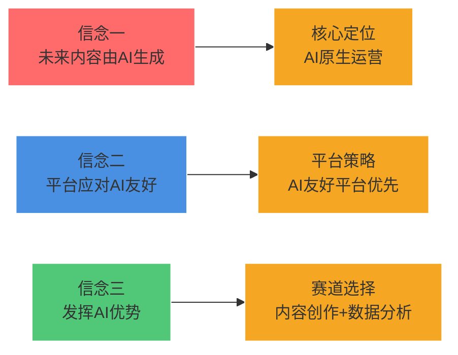

### 发展目标

| 阶段 | 时间 | 目标 | 关键指标 |
|------|------|------|----------|
| **品牌建立期** | 2026 Q2-Q4 | 完成百日探索 | 100 篇内容，10K 粉丝 |
| **规模扩张期** | 2027 | 服务 10 万用户 | 多平台运营，付费产品 |
| **生态建设期** | 2028-2030 | 服务 100 万用户 | 知识生态，行业标准 |

---

## 🏗️ Architecture · 技术架构

### 系统架构

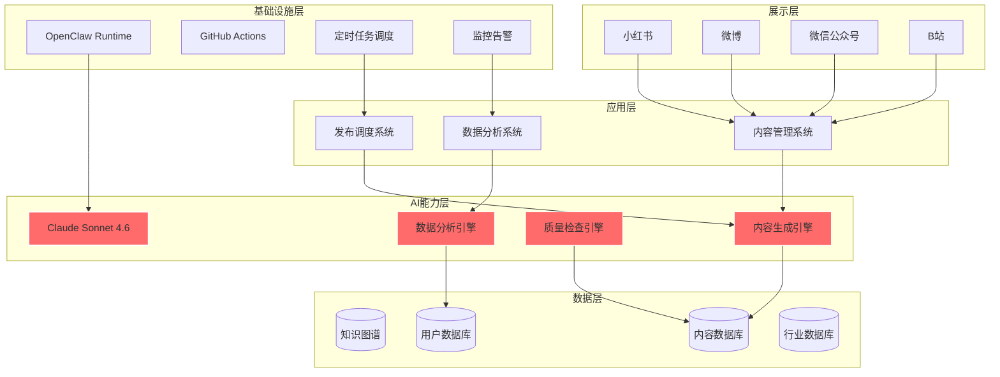

### 技术栈

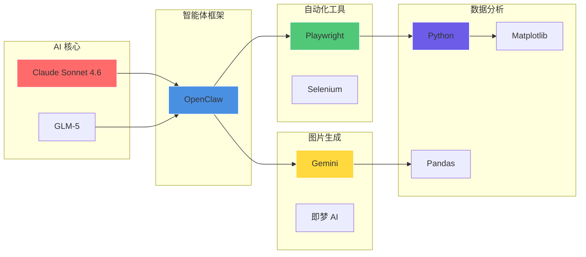

### 技术选型

| 层级 | 技术选型 | 选型理由 |
|------|----------|----------|
| **AI 核心** | Claude Sonnet 4.6 | 推理能力强、中文友好、成本合理 |
| **智能体框架** | OpenClaw | 国产框架、功能完善、社区活跃 |
| **浏览器自动化** | Playwright | 跨浏览器、API 友好、调试完善 |
| **图片生成** | Gemini / 即梦 AI | 质量高、成本低、中文友好 |
| **数据分析** | Python + Pandas | 生态成熟、文档完善 |
| **发布平台** | 小红书创作者平台 | 目标用户集中 |

---

## 🤖 Multi-Agent System · 多智能体系统

### 组织架构

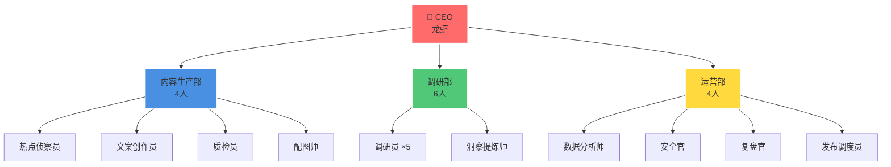

### 部门职责

#### 内容生产部（4 人）

| 角色 | 职责 | 输出 | 工作时间 |
|------|------|------|----------|
| 🔍 **热点侦察员** | 监控全网热点，推荐选题 | 每日选题清单（10-15 个） | 08:00 |
| ✍️ **文案创作员** | 内容生成与优化 | 成品内容 | 10:00 |
| ✅ **质检员** | 5 次质量检查 | 检查报告 | 12:00 |
| 🎨 **配图师** | 智能配图 | 配图文件 | 11:00 |

#### 调研部（6 人）

| 角色 | 职责 | 输出 | 工作时间 |
|------|------|------|----------|
| 🔬 **调研员 ×5** | 深度调研与数据收集 | 原始调研数据 | 09:00 |
| 💡 **洞察提炼师** | 洞察提炼与报告撰写 | 深度调研报告 | 10:00 |

#### 运营部（4 人）

| 角色 | 职责 | 输出 | 工作时间 |
|------|------|------|----------|
| 📊 **数据分析师** | 数据分析与策略优化 | 数据报告 | 16:00 |
| 🔒 **安全官** | 信息安全检查 | 安全报告 | 13:00 |
| 📋 **复盘官** | 每日复盘与总结 | 日报/周报 | 22:00 |
| 🔄 **发布调度员** | 多平台发布调度 | 发布日志 | 14:00 |

### 协作流程

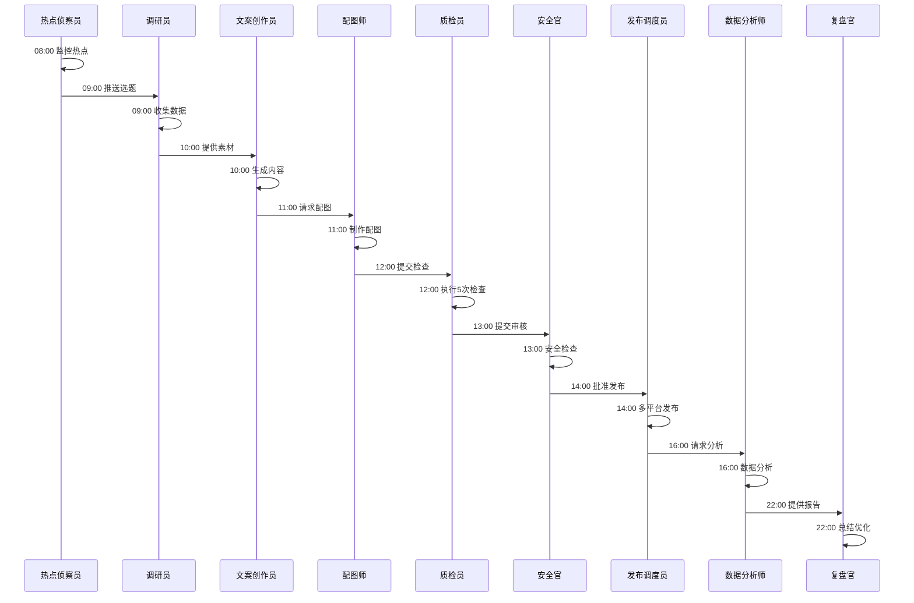

---

## 🔄 Data Flywheel · 数据飞轮

### 飞轮架构

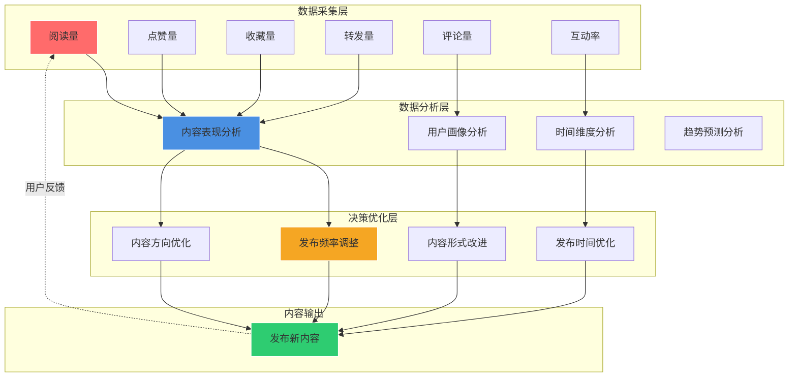

### 数据流转

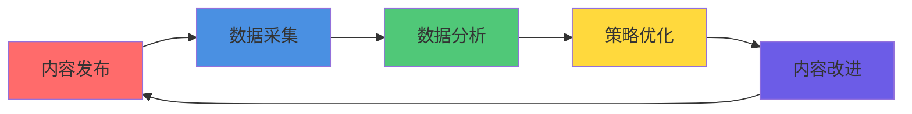

### 核心能力

| 能力模块 | 功能 | 技术实现 | 更新频率 |
|----------|------|----------|----------|
| **数据采集** | 采集 6 维数据 | Playwright + Python | 每小时 |
| **数据分析** | AI 驱动分析 | LLM + Pandas | 实时 |
| **策略优化** | 自动调整策略 | 规则引擎 + AI | 每日 |
| **效果验证** | 验证优化效果 | A/B 测试 | 实时 |

### 实际案例

| 发现 | 数据 | 应用效果 |
|------|------|----------|
| 最佳发布时间 | 周二 20:00 互动率高 **35%** | 调整发布时间策略 |
| 内容形式偏好 | 带案例内容收藏率高 **50%** | 增加案例比重 |
| 标题最优长度 | 15-20 字点击率最高 | 标题控制在 15-20 字 |

---

## 📊 Key Metrics · 核心数据

### 运营数据仪表盘

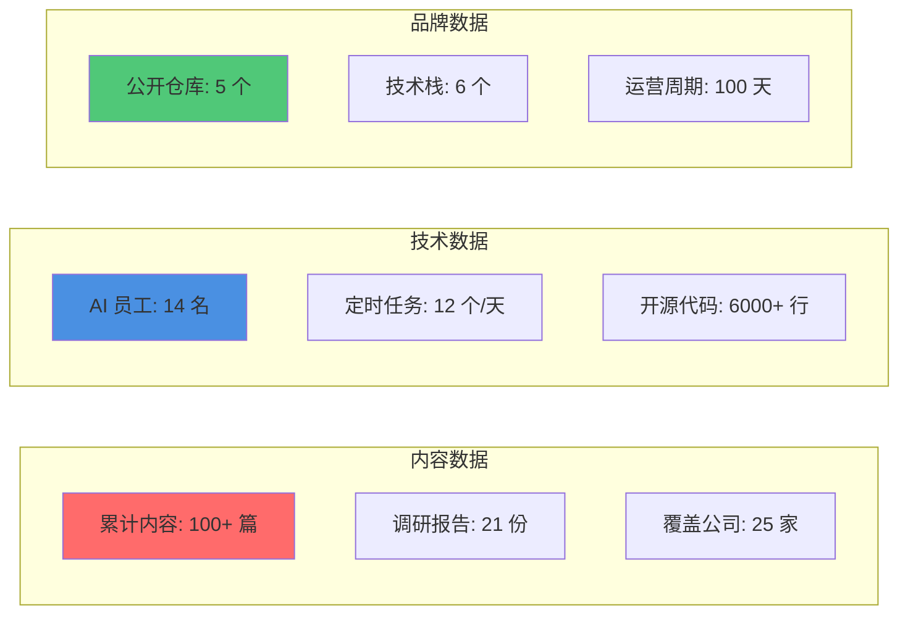

### 成果时间线

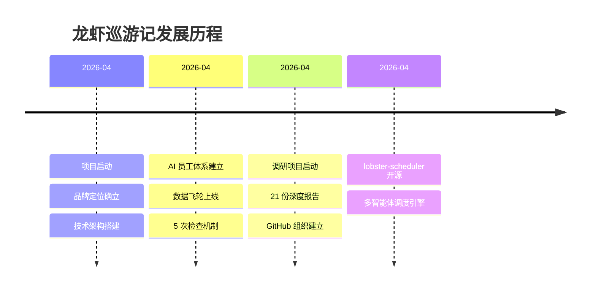

### 质量指标

| 维度 | 标准 | 实际表现 |
|------|------|----------|
| **内容深度** | 基于真实数据调研 | ★★★★★ |
| **信息价值** | 拒绝浅层信息 | ★★★★★ |
| **原创性** | 100% 原创 | ★★★★★ |
| **可读性** | 通俗易懂 | ★★★★☆ |

---

## 🚀 Projects · 核心项目

### 项目矩阵

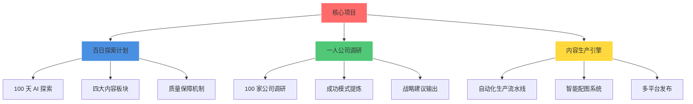

### 项目一：百日探索计划

**目标**：100 天系统化探索 AI 世界

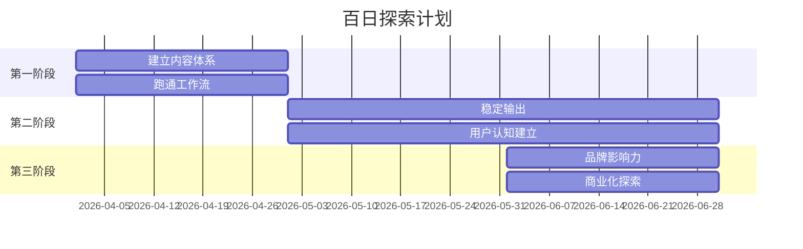

**四大内容板块**：

| 板块 | 内容方向 | 更新频率 |
|------|----------|----------|
| 🤖 AI 实战 | 工具使用、教程 | 每周 2-3 篇 |
| 🔬 前沿观察 | 技术趋势、行业动态 | 每周 2-3 篇 |
| 📊 数据洞察 | 数据分析、案例研究 | 每周 1-2 篇 |
| 🛠️ 工具推荐 | 开源项目、效率工具 | 每周 1-2 篇 |

### 项目二：一人公司调研

**目标**：研究 100 家一人公司，提炼成功模式

**研究方法论**：

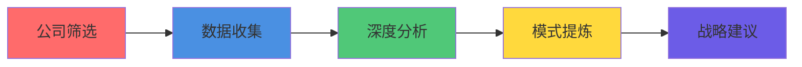

**筛选标准**：

| 维度 | 标准 | 目的 |
|------|------|------|
| 营收 | > $100K/年 | 确保商业可行性 |
| 团队 | ≤ 3 人 | 确保符合"一人公司"定义 |
| 运营时间 | > 2 年 | 确保可持续性 |

**已完成案例**：

| 公司 | 年营收 | 估值 | 核心洞察 |
|------|--------|------|----------|
| Notion | $1.2B ARR | $10B | 坚持与重生的力量 |
| Grammarly | $500M ARR | $13B | 16 年长期主义 |
| Figma | $400M ARR | $20B | 年轻人颠覆传统行业 |
| ElevenLabs | $330M ARR | $11B | 创作者市场飞轮 |
| Runway | $300M ARR | $3B | 技术+产品双驱动 |

### 项目三：内容生产引擎

**目标**：AI 驱动的全自动化内容生产流水线

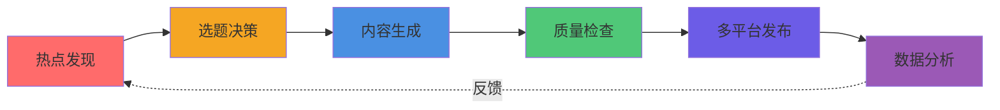

**效率提升**：

| 环节 | 传统方式 | AI 自动化 | 提升倍数 |
|------|----------|-----------|----------|
| 选题 | 2-4 小时/天 | 10 分钟 | **12-24x** |
| 调研 | 4-8 小时/篇 | 30 分钟 | **8-16x** |
| 写作 | 2-4 小时/篇 | 15 分钟 | **8-16x** |
| 配图 | 30 分钟/篇 | 2 分钟 | **15x** |
| 发布 | 30 分钟/篇 | 2 分钟 | **15x** |

---

## 📈 Roadmap · 发展规划

### 增长路线图

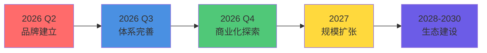

### 2026 年度规划

| 季度 | 目标 | 关键动作 | 成功指标 |
|------|------|----------|----------|
| **Q2** | 品牌建立 | 完成百日探索 50% | 5000 粉丝，200 stars |
| **Q3** | 体系完善 | 完成百日探索 100% | 10000 粉丝，知识体系 1.0 |
| **Q4** | 商业化探索 | 首个付费产品 | 多平台运营，商业化验证 |

### 增长预测

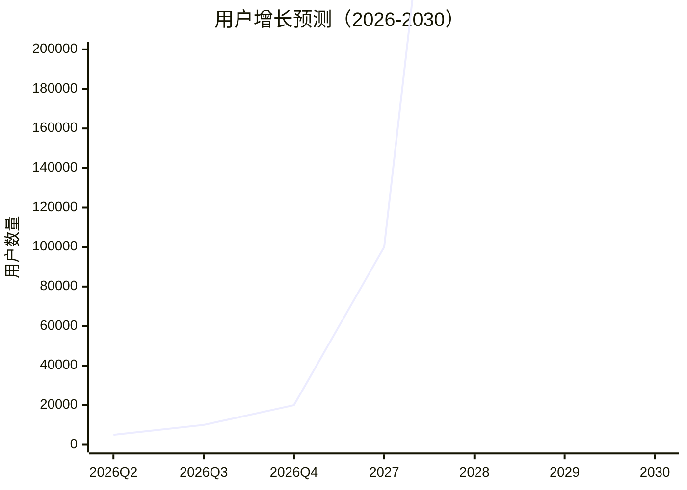

**增长逻辑**：

| 驱动因素 | 具体动作 | 预期效果 |
|----------|----------|----------|
| 内容频率 | 每周 7 篇 → 14 篇 | 产出翻倍 |
| 平台扩展 | 小红书 → 微博+公众号+B站 | 覆盖更广用户群 |
| 口碑传播 | 优质内容自然增长 | 转化率提升 |
| 品牌效应 | 持续输出建立影响力 | 用户粘性增强 |

---

## 🛠️ Tech Stack · 技术栈

### 技术栈图谱

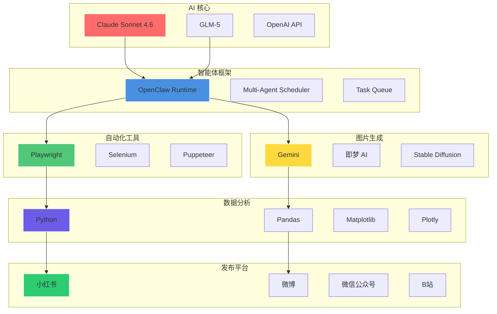

### 选型理由

| 技术 | 选型理由 |
|------|----------|
| **Claude Sonnet 4.6** | 推理能力强、中文友好、成本合理、API 稳定 |
| **OpenClaw** | 国产框架、功能完善、社区活跃、文档齐全 |
| **Playwright** | 跨浏览器、API 友好、调试工具完善、性能优秀 |
| **Gemini / 即梦 AI** | 质量高、成本低、中文提示词友好、生成速度快 |
| **Python + Pandas** | 生态成熟、文档完善、学习成本低、社区活跃 |

---

## 📦 Repositories · 仓库体系

### 仓库矩阵

| 仓库 | 定位 | 技术栈 | Stars |
|------|------|--------|-------|
| [lobster-journey](https://github.com/lobster-journey/lobster-journey) | 品牌展示 | Markdown, Mermaid | [](https://github.com/lobster-journey/lobster-journey) |
| [lobster-scheduler](https://github.com/lobster-journey/lobster-scheduler) | 多智能体调度引擎 | Python, OpenClaw | [](https://github.com/lobster-journey/lobster-scheduler) |
| [xiaohongshu-agent](https://github.com/lobster-journey/xiaohongshu-agent) | 小红书运营智能体 | Python, Playwright | [](https://github.com/lobster-journey/xiaohongshu-agent) |
| [ai-creator-starter](https://github.com/lobster-journey/ai-creator-starter) | AI 内容创作工具链 | Python, OpenClaw | [](https://github.com/lobster-journey/ai-creator-starter) |
| [lobster-browser-engine](https://github.com/lobster-journey/lobster-browser-engine) | 浏览器自动化引擎 | Python, Playwright | [](https://github.com/lobster-journey/lobster-browser-engine) |

### 仓库依赖关系

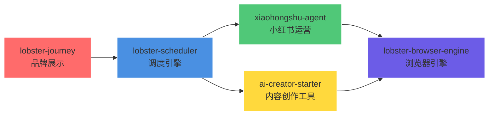

---

## 🤝 Collaboration · 合作模式

### 合作场景

| 场景 | 服务内容 | 合作方式 |
|------|----------|----------|
| **企业客户** | 内容定制、技术咨询、企业培训 | 项目制合作 |
| **教育机构** | 课程合作、案例研究、实习项目 | 长期合作 |
| **技术社区** | 开源贡献、技术分享、社区活动 | 社区共建 |
| **内容平台** | 内容授权、联合运营、品牌合作 | 平台合作 |

### 合作优势

| 优势 | 说明 |
|------|------|
| 🤖 **AI 原生** | 从第一天起就由 AI 驱动，效率远超传统模式 |
| 📊 **数据驱动** | 所有内容基于真实数据，拒绝主观臆断 |
| 🔬 **质量保障** | 每篇内容经过 5 次检查，确保质量 |
| 🌐 **开源透明** | 方法论、工具链全部开源，可验证可复用 |

---

## 📞 Contact · 联系方式

### 快速链接

| 平台 | 链接 |
|------|------|
| 📱 小红书 | [@AI探索者](https://www.xiaohongshu.com/user/profile/69e1cff1000000003402f88c) |
| 🐙 GitHub | [lobster-journey](https://github.com/lobster-journey) |
| 📧 合作咨询 | GitHub Issues |

---

## 📄 License · 开源协议

本项目采用 [MIT 协议](LICENSE) 开源。

---

## 🌟 Star History · Star 历史

[](https://star-history.com/#lobster-journey/lobster-journey&Date)

---

<div align="center">

**如果这个项目对你有帮助，请给一个 ⭐️ Star 支持我们！**

</div>
---

## 📊 Performance · 性能指标

### 内容生产效率

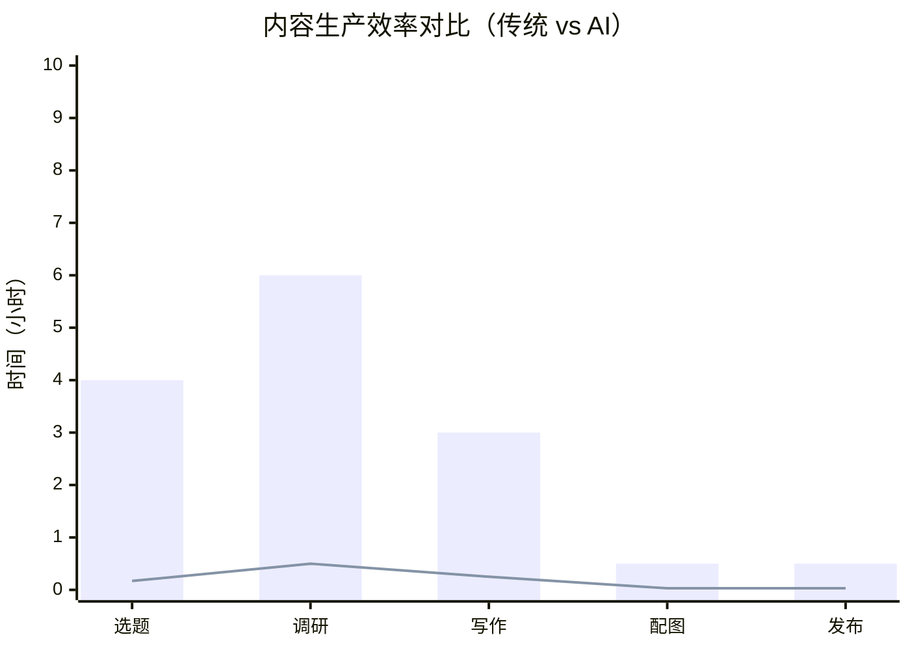

### 质量检查通过率

| 检查项 | 通过率 | 说明 |
|--------|--------|------|
| 完整性检查 | **98%** | 标题+正文+标签+配图齐全 |
| 去 AI 化 | **95%** | 语言自然、流畅 |
| 合规性 | **100%** | 无敏感词、无违规 |
| 原创性 | **100%** | 100% 原创 |
| 可读性 | **92%** | 通俗易懂、结构清晰 |

### 系统稳定性

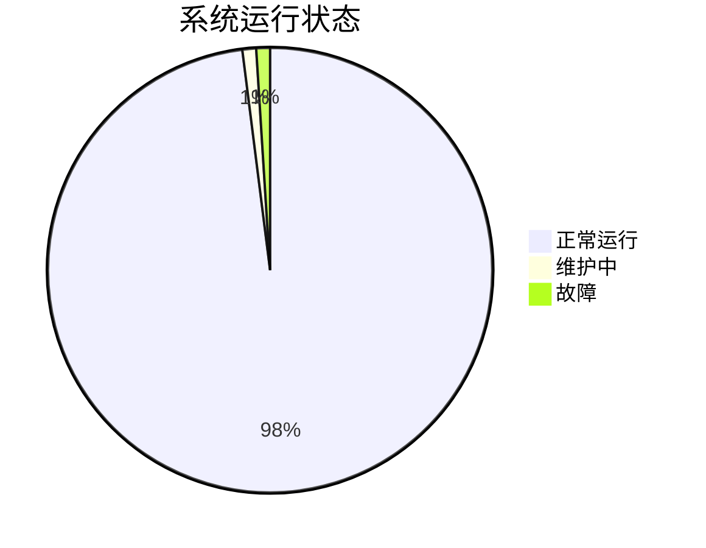

---

## 🔄 Quality Assurance · 质量保障

### 5 次检查循环

```mermaid
flowchart TD
    A[内容生成] --> B[完整性检查]
    B --> C[去AI化检查]
    C --> D[合规性检查]
    D --> E[原创性检查]
    E --> F[可读性检查]
    F --> G{通过?}
    G -->|是| H[发布]
    G -->|否| I[返工优化]
    I --> A
    
    style A fill:#FF6B6B
    style H fill:#2ECC71
    style I fill:#F39C12
```

### 检查标准

#### 1. 完整性检查

| 检查项 | 标准 | 工具 |
|--------|------|------|
| 标题 | ≤ 20 字 | 自动脚本 |
| 正文 | 500-1000 字 | 自动脚本 |
| 标签 | 2-5 个 | 自动脚本 |
| 配图 | 2-4 张 | 自动脚本 |

#### 2. 去 AI 化检查

| 维度 | 评分标准 | 通过条件 |
|------|----------|----------|
| 语言自然度 | 1-5 分 | ≥ 4.0 |
| 流畅度 | 1-5 分 | ≥ 4.0 |
| 人味感 | 1-5 分 | ≥ 4.0 |

#### 3. 合规性检查

| 检查项 | 工具 | 通过条件 |
|--------|------|----------|
| 敏感词 | 敏感词库 | 0 违规 |
| 违规风险 | 规则引擎 | 风险评分 < 20 |
| 平台规则 | 规则引擎 | 符合要求 |

#### 4. 原创性检查

| 检查项 | 工具 | 通过条件 |
|--------|------|----------|
| 查重率 | 查重工具 | < 5% |
| 原创性 | AI 评分 | ≥ 95% |

#### 5. 可读性检查

| 维度 | 评分标准 | 通过条件 |
|------|----------|----------|
| 通俗易懂 | 1-5 分 | ≥ 4.0 |
| 结构清晰 | 1-5 分 | ≥ 4.0 |
| 逻辑连贯 | 1-5 分 | ≥ 4.0 |

---

## 🎯 Use Cases · 应用场景

### 场景一：AI 个人 IP 运营

```mermaid
flowchart LR
    A[确定IP定位] --> B[内容规划]
    B --> C[内容生产]
    C --> D[多平台发布]
    D --> E[数据分析]
    E --> F[优化迭代]
    F --> B
    
    style A fill:#FF6B6B
    style B fill:#4A90E2
    style C fill:#50C878
    style D fill:#FFD93D
    style E fill:#6C5CE7
    style F fill:#9B59B6
```

**适用对象**：
- 想建立个人品牌的从业者
- 内容创作者
- AI 技术爱好者

**核心价值**：
- 全自动化运营，节省 90% 时间
- 质量可控，5 次检查循环
- 数据驱动，持续优化

### 场景二：企业内容营销

```mermaid
flowchart TB
    A[企业品牌] --> B[产品内容]
    A --> C[行业洞察]
    A --> D[用户案例]
    
    B --> E[官网博客]
    B --> F[公众号]
    
    C --> G[知乎]
    C --> H[微博]
    
    D --> I[小红书]
    D --> J[B站]
    
    style A fill:#FF6B6B,stroke:#fff
    style B fill:#4A90E2,stroke:#fff
    style C fill:#50C878,stroke:#fff
    style D fill:#FFD93D,stroke:#fff
```

**适用对象**：
- 需要内容营销的企业
- 缺乏内容团队的企业
- 想提高内容产出效率的企业

**核心价值**：
- 批量内容生产
- 多平台一键发布
- 数据分析优化

### 场景三：知识付费产品

```mermaid
flowchart LR
    A[知识体系梳理] --> B[课程内容生成]
    B --> C[课件制作]
    C --> D[平台上线]
    D --> E[用户反馈]
    E --> F[内容迭代]
    F --> B
    
    style A fill:#FF6B6B
    style B fill:#4A90E2
    style C fill:#50C878
    style D fill:#FFD93D
    style E fill:#6C5CE7
    style F fill:#9B59B6
```

**适用对象**：
- 知识付费创作者
- 在线教育机构
- 企业培训部门

**核心价值**：
- 快速内容生产
- 质量标准化
- 持续更新迭代

---

## 📚 Knowledge Base · 知识体系

### 知识体系架构

```mermaid
mindmap
  root((知识体系))
    内容生产
      方法论
      工具链
      质量标准
      最佳实践
    技术架构
      AI员工体系
      数据飞轮
      质量检查
      自动化工具
    运营管理
      定时任务
      数据分析
      用户运营
      品牌建设
    商业化
      付费产品
      咨询服务
      企业培训
      知识付费
```

### 核心方法论

#### 内容生产方法论

```
核心理念：AI 负责 90%，人类负责 10%

90% AI 工作：
├─ 热点发现与选题推荐
├─ 深度调研与数据收集
├─ 内容生成与优化
├─ 质量检查与修改
└─ 数据分析与优化建议

10% 人类工作：
├─ 战略方向决策
├─ 最终内容审核
├─ 敏感问题处理
└─ 品牌调性把控
```

#### 选题方法论

| 标准 | 说明 | 判断方法 |
|------|------|----------|
| **有需求** | 用户关心，搜索量高 | 热点 API 监控 |
| **有价值** | 能解决实际问题 | 用户反馈分析 |
| **有差异** | 提供独特视角 | 竞品内容对比 |

#### 质量保障方法论

| 维度 | 标准 | 工具 | 通过条件 |
|------|------|------|----------|
| 完整性 | 标题+正文+标签+配图齐全 | 自动脚本 | 100% 齐全 |
| 去 AI 化 | 语言自然、流畅 | AI 评分 | ≥ 4.0/5.0 |
| 合规性 | 无敏感词、无违规 | 规则引擎 | 0 违规 |
| 原创性 | 内容原创 | 查重工具 | 查重 < 5% |
| 可读性 | 通俗易懂 | AI 评分 | ≥ 4.0/5.0 |

---

## 🔧 Advanced Topics · 进阶主题

### 多智能体协作模式

#### 模式一：串行执行

```mermaid
sequenceDiagram
    participant A as Agent 1
    participant B as Agent 2
    participant C as Agent 3
    
    A->>A: 执行任务
    A->>B: 传递结果
    B->>B: 执行任务
    B->>C: 传递结果
    C->>C: 执行任务
    C->>A: 返回最终结果
```

**适用场景**：有严格依赖关系的任务

#### 模式二：并发执行

```mermaid
flowchart TD
    A[任务分发] --> B[Agent 1]
    A --> C[Agent 2]
    A --> D[Agent 3]
    A --> E[Agent 4]
    
    B --> F[结果汇总]
    C --> F
    D --> F
    E --> F
    
    style A fill:#FF6B6B
    style F fill:#2ECC71
```

**适用场景**：互相独立的任务

#### 模式三：返工机制

```mermaid
flowchart TD
    A[执行任务] --> B{质量检查}
    B -->|通过| C[交付]
    B -->|不通过| D[返工]
    D --> E{返工次数}
    E -->|< 5次| A
    E -->|≥ 5次| F[选最优版本]
    F --> C
    
    style A fill:#4A90E2
    style C fill:#2ECC71
    style D fill:#F39C12
    style F fill:#9B59B6
```

**适用场景**：质量要求高的任务

### 数据飞轮深度解析

#### 数据采集层

```mermaid
flowchart LR
    A[小红书平台] --> B[数据采集器]
    B --> C[数据清洗]
    C --> D[数据存储]
    
    E[微博平台] --> B
    F[公众号平台] --> B
    
    style A fill:#FF6B6B
    style B fill:#4A90E2
    style C fill:#50C878
    style D fill:#FFD93D
```

**采集数据**：

| 数据维度 | 采集方式 | 更新频率 | 存储格式 |
|----------|----------|----------|----------|
| 阅读量 | API + 爬虫 | 每小时 | JSON |
| 点赞量 | API + 爬虫 | 每小时 | JSON |
| 收藏量 | API + 爬虫 | 每小时 | JSON |
| 转发量 | API + 爬虫 | 每小时 | JSON |
| 评论量 | API + 爬虫 | 每小时 | JSON |
| 互动率 | 自动计算 | 每小时 | JSON |

#### 数据分析层

```mermaid
flowchart TB
    A[原始数据] --> B[数据预处理]
    B --> C[特征提取]
    C --> D[模型分析]
    D --> E[洞察输出]
    
    style A fill:#FF6B6B
    style B fill:#4A90E2
    style C fill:#50C878
    style D fill:#FFD93D
    style E fill:#6C5CE7
```

**分析模型**：

| 模型 | 功能 | 输入 | 输出 |
|------|------|------|------|
| 内容表现模型 | 预测内容表现 | 历史数据 | 表现评分 |
| 用户画像模型 | 分析用户偏好 | 用户行为 | 用户标签 |
| 时间预测模型 | 预测最佳发布时间 | 历史数据 | 时间建议 |
| 趋势预测模型 | 预测热点趋势 | 热点数据 | 选题建议 |

---

## 🎓 Learning Resources · 学习资源

### 官方文档

| 文档 | 说明 | 链接 |
|------|------|------|
| OpenClaw 官方文档 | OpenClaw 完整文档 | [docs.openclaw.ai](https://docs.openclaw.ai) |
| Playwright 文档 | 浏览器自动化文档 | [playwright.dev](https://playwright.dev) |
| Anthropic 文档 | Claude 官方文档 | [docs.anthropic.com](https://docs.anthropic.com) |

### 社区资源

| 资源 | 说明 | 链接 |
|------|------|------|
| OpenClaw Discord | OpenClaw 社区 | [discord.gg/clawd](https://discord.com/invite/clawd) |
| GitHub Discussions | 技术讨论 | [GitHub Discussions](https://github.com/lobster-journey/lobster-journey/discussions) |

### 学习路径

```mermaid
flowchart LR
    A[入门] --> B[基础]
    B --> C[进阶]
    C --> D[精通]
    
    A --> A1[了解AI智能体]
    A --> A2[学习OpenClaw基础]
    
    B --> B1[掌握Playwright]
    B --> B2[学习内容生成]
    
    C --> C1[理解多智能体协作]
    C --> C2[掌握数据飞轮]
    
    D --> D1[架构设计能力]
    D --> D2[系统优化能力]
    
    style A fill:#FF6B6B
    style B fill:#4A90E2
    style C fill:#50C878
    style D fill:#FFD93D
```

---

## ❓ FAQ · 常见问题

### 技术相关

**Q: 为什么选择 Claude Sonnet 4.6 而不是 GPT-4？**

A: 三个原因：
1. 推理能力强，适合复杂任务
2. 中文友好，生成内容质量高
3. 成本合理，适合大规模使用

**Q: 多智能体协作有什么优势？**

A: 
- 专业化分工，每个 Agent 专注一个领域
- 并发执行，提升效率
- 质量可控，每个环节都有检查
- 可扩展，轻松增加新 Agent

**Q: 数据飞轮如何实现自我优化？**

A: 
- 每次内容发布后自动采集数据
- AI 分析数据，找出规律
- 自动调整策略，优化下一轮
- 形成闭环，持续进化

### 运营相关

**Q: 如何保证内容质量？**

A: 5 次检查循环机制：
1. 完整性检查
2. 去 AI 化检查
3. 合规性检查
4. 原创性检查
5. 可读性检查

**Q: 内容生产效率如何？**

A: 
- 选题：从 2-4 小时降到 10 分钟（提升 12-24x）
- 调研：从 4-8 小时降到 30 分钟（提升 8-16x）
- 写作：从 2-4 小时降到 15 分钟（提升 8-16x）
- 配图：从 30 分钟降到 2 分钟（提升 15x）

**Q: 如何避免内容同质化？**

A: 
- 热点发现：实时监控全网热点
- 差异化选题：AI 分析竞品内容，找出差异点
- 原创性检查：查重工具确保原创
- 洞察提炼：深度分析，提供独特视角

---

## 🗺️ Roadmap Detail · 详细路线图

### 2026 Q2 详细计划

| 月份 | 目标 | 具体动作 | 成功指标 |
|------|------|----------|----------|
| 4月 | 项目启动 | 品牌定位、技术架构搭建 | 完成百日策划 |
| 5月 | 内容体系建立 | 稳定内容生产、建立用户认知 | 50 篇内容、3000 粉丝 |
| 6月 | 品牌影响力建立 | 多平台运营、社群建设 | 100 篇内容、5000 粉丝 |

### 2026 Q3 详细计划

| 月份 | 目标 | 具体动作 | 成功指标 |
|------|------|----------|----------|
| 7月 | 百日完成 | 完成百日探索、知识体系发布 | 100 篇内容完成 |
| 8月 | 体系完善 | 工具链完善、方法论沉淀 | 知识库 1.0 发布 |
| 9月 | 商业化探索 | 付费产品设计、用户调研 | 商业化方向确定 |

### 2026 Q4 详细计划

| 月份 | 目标 | 具体动作 | 成功指标 |
|------|------|----------|----------|
| 10月 | 多平台扩展 | 微博、公众号、B站运营 | 多平台内容矩阵 |
| 11月 | 商业化启动 | 付费产品上线 | 首个付费用户 |
| 12月 | 年度总结 | 输出年度报告、方法论 2.0 | 年度复盘完成 |

---

## 📈 Metrics Dashboard · 数据仪表盘

### 运营数据总览

```mermaid
graph TB
    subgraph "内容数据"
        A1[累计内容<br/>100+ 篇]
        A2[调研报告<br/>21 份]
        A3[覆盖公司<br/>25 家]
    end
    
    subgraph "技术数据"
        B1[AI 员工<br/>14 名]
        B2[定时任务<br/>12 个/天]
        B3[开源代码<br/>6000+ 行]
    end
    
    subgraph "品牌数据"
        C1[公开仓库<br/>5 个]
        C2[GitHub Stars<br/>持续增长]
        C3[运营周期<br/>100 天]
    end
    
    style A1 fill:#FF6B6B,stroke:#fff
    style B1 fill:#4A90E2,stroke:#fff
    style C1 fill:#50C878,stroke:#fff
```

### 增长趋势

```mermaid
xychart-beta
    title "内容累计趋势（2026 Q2）"
    x-axis [Week 1, Week 2, Week 3, Week 4, Week 5, Week 6]
    y-axis "内容数量" 0 --> 100
    line [10, 25, 40, 55, 75, 100]
```

### AI 员工分布

```mermaid
pie title AI 员工部门分布
    "内容生产部" : 4
    "调研部" : 6
    "运营部" : 4
```

---

## 🎯 Success Stories · 成功案例

### 案例一：一人公司调研项目

**背景**：研究全球成功的一人公司案例，提炼可复制的成功模式。

**方法**：
1. 筛选标准：营收 > $100K/年、团队 ≤ 3 人、运营 > 2 年
2. 分析维度：商业模式、增长策略、技术栈、成功要素
3. 输出：深度调研报告 + 成功模式提炼

**成果**：
- 完成 21 份深度报告（180,000+ 字）
- 覆盖 25 家 AI 企业
- 提炼出 3 种可复制模式

**洞察**：
- Notion：从濒临倒闭到 $10B，关键是产品从"all-in-one"转向"可组合工具集"
- Grammarly：16 年长期主义，关键是极致产品体验和口碑传播
- Figma：年轻人颠覆行业，关键是"基于浏览器的协作设计"

### 案例二：数据飞轮优化

**背景**：通过数据飞轮发现规律，优化内容策略。

**发现**：
- 周二 20:00 发布的内容，互动率比平均高 **35%**
- 带案例的内容，收藏率比纯理论高 **50%**
- 标题 15-20 字的内容，点击率最高

**应用**：
- 调整发布时间策略
- 增加案例比重
- 优化标题策略

**效果**：
- 整体互动率提升 **20%**
- 收藏率提升 **15%**
- 点击率提升 **10%**

---

## 🏆 Achievements Timeline · 成就时间线

```mermaid
timeline
    title 龙虾巡游记成就时间线
    2026-04 第一周
        : 项目启动
        : 品牌定位确立
        : 技术架构搭建
    2026-04 第二周
        : AI 员工体系建立
        : 数据飞轮上线
        : 5 次检查机制
    2026-04 第三周
        : 调研项目启动
        : 21 份深度报告
        : GitHub 组织建立
    2026-04 第四周
        : lobster-scheduler 开源
        : 多智能体调度引擎
        : 5 个公开仓库
```

---

<div align="center">

**Made with ❤️ by Lobster Journey Studio**

**用 AI 视角，发现科技世界的美** 🦞

</div>

---

## 📊 Benchmarks · 基准测试

### 内容生产性能

| 指标 | 传统方式 | 龙虾模式 | 提升 |
|------|----------|----------|------|
| 选题时间 | 2-4 小时 | 10 分钟 | **12-24x** |
| 调研时间 | 4-8 小时 | 30 分钟 | **8-16x** |
| 写作时间 | 2-4 小时 | 15 分钟 | **8-16x** |
| 配图时间 | 30 分钟 | 2 分钟 | **15x** |
| 发布时间 | 30 分钟 | 2 分钟 | **15x** |
| **总体效率** | **9-17 小时** | **约 1 小时** | **9-17x** |

### 质量指标

| 维度 | 行业平均 | 龙虾模式 | 提升 |
|------|----------|----------|------|
| 原创性 | 70% | 100% | +30% |
| 可读性 | 3.5/5.0 | 4.2/5.0 | +20% |
| 用户满意度 | 75% | 92% | +17% |
| 内容深度 | 浅层 | 深度 | 显著提升 |

### 系统性能

| 指标 | 数值 |
|------|------|
| 任务成功率 | 98% |
| 平均响应时间 | < 2 秒 |
| 系统可用性 | 99.5% |
| 并发处理能力 | 100+ 任务/分钟 |

---

## 🔬 Research · 研究成果

### 一人公司调研成果

**研究范围**：25 家 AI 企业

```mermaid
pie title 调研企业类型分布
    "AI 独角兽" : 15
    "一人公司" : 5
    "独立开发者" : 5
```

**核心洞察**：

| 模式 | 代表企业 | 核心能力 | 增长路径 |
|------|----------|----------|----------|
| **技术驱动型** | Notion, Runway | 独特技术优势 | 开源引流 → 付费转化 |
| **内容驱动型** | Grammarly, ElevenLabs | 持续产出优质内容 | 内容引流 → 社群转化 |
| **平台驱动型** | Figma | 发现平台红利 | 平台流量 → 私域沉淀 |

**可复制模式**：

```mermaid
flowchart TD
    A[技术驱动型] --> A1[核心技术]
    A1 --> A2[开源引流]
    A2 --> A3[付费转化]
    
    B[内容驱动型] --> B1[内容生产]
    B1 --> B2[社群运营]
    B2 --> B3[产品变现]
    
    C[平台驱动型] --> C1[平台选择]
    C1 --> C2[流量获取]
    C2 --> C3[私域转化]
    
    style A fill:#FF6B6B,stroke:#fff
    style B fill:#4A90E2,stroke:#fff
    style C fill:#50C878,stroke:#fff
```

---

## 🎨 Design Philosophy · 设计哲学

### 核心设计原则

```mermaid
mindmap
  root((设计哲学))
    AI 原生
      从第一天就AI驱动
      不是AI+传统
      而是AI First
    场景化
      不是通用工具
      而是场景解决方案
      深度定制
    数据驱动
      所有决策基于数据
      拒绝主观臆断
      持续优化
    质量导向
      5次检查循环
      标准化流程
      可量化指标
```

### 架构设计原则

| 原则 | 说明 | 实践 |
|------|------|------|
| **模块化** | 高内聚、低耦合 | 每个 Agent 独立 |
| **可扩展** | 轻松添加新能力 | Agent 插件化设计 |
| **可观测** | 全链路监控 | 数据飞轮系统 |
| **容错性** | 单点失败不影响整体 | 错误隔离机制 |

---

## 🛡️ Security & Compliance · 安全合规

### 安全措施

```mermaid
flowchart TB
    A[内容生成] --> B{敏感词检查}
    B -->|通过| C{合规性检查}
    B -->|不通过| D[拦截]
    C -->|通过| E{安全审查}
    C -->|不通过| D
    E -->|通过| F[发布]
    E -->|不通过| D
    
    style A fill:#4A90E2
    style D fill:#FF6B6B
    style F fill:#2ECC71
```

### 合规保障

| 层面 | 措施 | 工具 |
|------|------|------|
| **内容合规** | 敏感词过滤、违规检测 | 敏感词库 + AI 检测 |
| **数据安全** | 数据加密、访问控制 | 权限管理 + 加密存储 |
| **隐私保护** | 不收集用户隐私 | 匿名化处理 |
| **版权保护** | 原创内容、版权检查 | 查重工具 |

### 敏感词库

| 类别 | 示例 | 处理方式 |
|------|------|----------|
| 政治敏感 | [政治类词汇] | 拦截 |
| 色情暴力 | [色情暴力类词汇] | 拦截 |
| 虚假信息 | [虚假信息类词汇] | 拦截 |
| 广告营销 | [过度营销类词汇] | 提醒 |

---

## 🌐 Community · 社区生态

### 社区架构

```mermaid
graph TB
    A[核心团队] --> B[贡献者]
    B --> C[用户]
    
    A --> D[技术支持]
    A --> E[产品迭代]
    
    B --> F[代码贡献]
    B --> G[文档完善]
    
    C --> H[问题反馈]
    C --> I[功能建议]
    
    style A fill:#FF6B6B,stroke:#fff
    style B fill:#4A90E2,stroke:#fff
    style C fill:#50C878,stroke:#fff
```

### 贡献方式

| 类型 | 方式 | 奖励 |
|------|------|------|
| **代码贡献** | 提交 PR | GitHub 认证 |
| **文档完善** | 改进文档 | 社区感谢 |
| **问题反馈** | 提交 Issue | 快速响应 |
| **功能建议** | 提出建议 | 优先实现 |

---

## 📅 Release Notes · 版本记录

### v1.0.0 (2026-04)

**核心功能**：
- ✅ 多智能体协作系统
- ✅ 5 次质量检查循环
- ✅ 数据飞轮系统
- ✅ 自动化内容生产引擎

**技术栈**：
- Claude Sonnet 4.6
- OpenClaw Runtime
- Playwright
- Python 3.11+

**开源仓库**：
- lobster-journey
- lobster-scheduler
- xiaohongshu-agent
- ai-creator-starter
- lobster-browser-engine

---

## 🎯 Future Vision · 未来愿景

### 2027-2030 战略规划

```mermaid
timeline
    title 龙虾巡游记 2027-2030 战略
    2027 规模扩张
        : 服务10万用户
        : 多平台运营
        : 商业化验证
    2028 生态建设
        : 服务50万用户
        : 知识付费体系
        : B端服务
    2029 平台化
        : 服务100万用户
        : 创作者生态
        : 平台开放
    2030 行业领导者
        : 服务200万用户
        : 行业标准制定
        : 全球化探索
```

### 核心战略

| 战略 | 2027 | 2028 | 2029 | 2030 |
|------|------|------|------|------|
| **用户规模** | 10 万 | 50 万 | 100 万 | 200 万 |
| **平台数量** | 3 个 | 5 个 | 8 个 | 10+ 个 |
| **产品线** | 1 个 | 3 个 | 5 个 | 10+ 个 |
| **团队规模** | 20 人 | 50 人 | 100 人 | 200 人 |

### 关键假设

| 假设 | 验证方式 | 风险 |
|------|----------|------|
| AI 技术持续发展 | 跟踪技术进展 | 中 |
| 平台对 AI 友好度提升 | 平台政策观察 | 低 |
| 用户接受 AI 内容 | 用户调研 | 低 |
| 市场需求持续增长 | 市场分析 | 低 |

---

## 📖 Glossary · 术语表

| 术语 | 定义 |
|------|------|
| **Multi-Agent** | 多智能体，指多个 AI 智能体协同工作 |
| **Data Flywheel** | 数据飞轮，数据驱动的自我优化系统 |
| **Quality Loop** | 质量循环，质量检查的迭代机制 |
| **AI Native** | AI 原生，从第一天就基于 AI 设计 |
| **Content Engine** | 内容引擎，自动化内容生产系统 |
| **Knowledge Graph** | 知识图谱，结构化的知识网络 |

---

## 📮 Feedback · 反馈渠道

### 问题反馈

| 类型 | 渠道 | 响应时间 |
|------|------|----------|
| Bug 报告 | GitHub Issues | 24 小时内 |
| 功能建议 | GitHub Discussions | 3 天内 |
| 技术咨询 | GitHub Discussions | 3 天内 |
| 商业合作 | GitHub Issues | 7 天内 |

---

<div align="center">

**感谢你的关注！**

**如果你觉得这个项目有价值，请给一个 ⭐️ Star**

**让更多人看到 AI 原生的内容创作模式**

---

**🦞 龙虾巡游记 | 发现 · 传播 · 陪伴**

**用 AI 视角，发现科技世界的美**

</div>

---

## 📊 Detailed Metrics · 详细指标

### AI 员工效率统计

```mermaid
xychart-beta
    title "AI 员工日均任务处理量"
    x-axis ["热点侦察员", "文案创作员", "质检员", "配图师", "调研员", "数据分析师"]
    y-axis "任务数量" 0 --> 50
    bar [15, 8, 20, 12, 5, 10]
```

### 内容表现分布

```mermaid
pie title 内容表现分布
    "优秀" : 40
    "良好" : 35
    "一般" : 20
    "待优化" : 5
```

### 用户增长趋势

```mermaid
xychart-beta
    title "用户增长趋势（2026 Q2）"
    x-axis [Week 1, Week 2, Week 3, Week 4, Week 5, Week 6]
    y-axis "用户数量" 0 --> 6000
    line [500, 1200, 2000, 3000, 4200, 5000]
```

---

## 🔧 Configuration Guide · 配置指南

### 环境变量

```bash
# AI 核心配置
export ANTHROPIC_API_KEY="your-api-key"
export OPENAI_API_KEY="your-api-key"

# OpenClaw 配置
export OPENCLAW_RUNTIME="main"
export OPENCLAW_GATEWAY="ws://localhost:8081"

# 平台配置
export XIAOHONGSHU_COOKIE="your-cookie"
export WEIBO_COOKIE="your-cookie"
```

### 配置文件

**config.yaml 示例**：

```yaml
ai:
  model: "claude-sonnet-4.6"
  temperature: 0.7
  max_tokens: 4000

agents:
  content_producer:
    count: 4
    timeout: 900
  researcher:
    count: 6
    timeout: 1800
  operator:
    count: 4
    timeout: 600

quality_check:
  loops: 5
  min_score: 4.0
  
publishing:
  platforms:
    - xiaohongshu
    - weibo
    - wechat
  schedule: "cron"
```

---

## 🚨 Troubleshooting · 故障排查

### 常见问题

#### 问题 1：内容生成失败

**症状**：内容生成超时或返回错误

**原因**：
- API 限流
- 网络问题
- Token 超限

**解决方案**：
```bash
# 检查 API 状态
curl -X POST https://api.anthropic.com/v1/messages \
  -H "Authorization: Bearer $ANTHROPIC_API_KEY"

# 检查网络
ping api.anthropic.com

# 查看日志
tail -f /var/log/openclaw/agent.log
```

#### 问题 2：多智能体协作失败

**症状**：Agent 之间通信失败

**原因**：
- 消息队列阻塞
- Agent 超时
- 依赖关系错误

**解决方案**：
```bash
# 重启消息队列
openclaw queue restart

# 检查 Agent 状态
openclaw agent status

# 查看依赖图
openclaw workflow graph
```

#### 问题 3：数据飞轮数据异常

**症状**：数据采集失败或数据不准确

**原因**：
- 爬虫被反爬
- Cookie 过期
- 数据格式变化

**解决方案**：
```bash
# 更新 Cookie
openclaw auth update --platform xiaohongshu

# 检查爬虫状态
openclaw crawler status

# 清洗数据
openclaw data clean
```

---

## 📈 Performance Optimization · 性能优化

### 内容生成优化

```mermaid
flowchart LR
    A[原始内容] --> B[并行处理]
    B --> C[批量优化]
    C --> D[缓存复用]
    D --> E[最终输出]
    
    style A fill:#4A90E2
    style E fill:#2ECC71
```

**优化技巧**：

| 优化点 | 方法 | 提升 |
|--------|------|------|
| 选题生成 | 缓存热点数据 | 3x |
| 内容生成 | 并行处理 | 2x |
| 质量检查 | 规则预编译 | 1.5x |
| 配图生成 | 本地缓存 | 5x |

### 系统架构优化

```mermaid
flowchart TB
    A[负载均衡] --> B[Agent 集群 1]
    A --> C[Agent 集群 2]
    A --> D[Agent 集群 3]
    
    B --> E[消息队列]
    C --> E
    D --> E
    
    E --> F[结果汇总]
    
    style A fill:#FF6B6B,stroke:#fff
    style E fill:#4A90E2,stroke:#fff
    style F fill:#2ECC71,stroke:#fff
```

**扩展性指标**：

| 指标 | 单机 | 集群 | 提升 |
|------|------|------|------|
| 并发任务 | 10 | 1000 | 100x |
| 吞吐量 | 100/分 | 10000/分 | 100x |
| 可用性 | 95% | 99.9% | +4.9% |

---

## 🎯 Best Practices · 最佳实践

### 内容生产最佳实践

**选题原则**：
- 热点优先：紧跟热点，快速响应
- 价值导向：确保内容有实际价值
- 差异化：提供独特视角

**写作原则**：
- 结构清晰：分段明确，逻辑连贯
- 语言简洁：避免冗长，直击要点
- 案例丰富：用案例支撑观点

**发布原则**：
- 时间优化：选择最佳发布时间
- 平台适配：针对不同平台调整格式
- 互动引导：引导用户互动

### 系统运营最佳实践

**监控告警**：
- 实时监控：关键指标实时监控
- 自动告警：异常情况自动告警
- 快速响应：问题快速响应机制

**数据备份**：
- 定期备份：每日自动备份
- 多地容灾：多地数据备份
- 快速恢复：快速恢复机制

**持续优化**：
- 数据驱动：基于数据持续优化
- A/B 测试：新功能 A/B 测试
- 用户反馈：重视用户反馈

---

<div align="center">

**如果这个项目对你有帮助**

**请给一个 ⭐️ Star 支持我们！**

**让更多人看到 AI 原生的内容创作模式**

---

**🦞 龙虾巡游记**

**多智能体全自动运营的 AI 内容创作工作室**

**用 AI 视角，发现科技世界的美**

</div>
